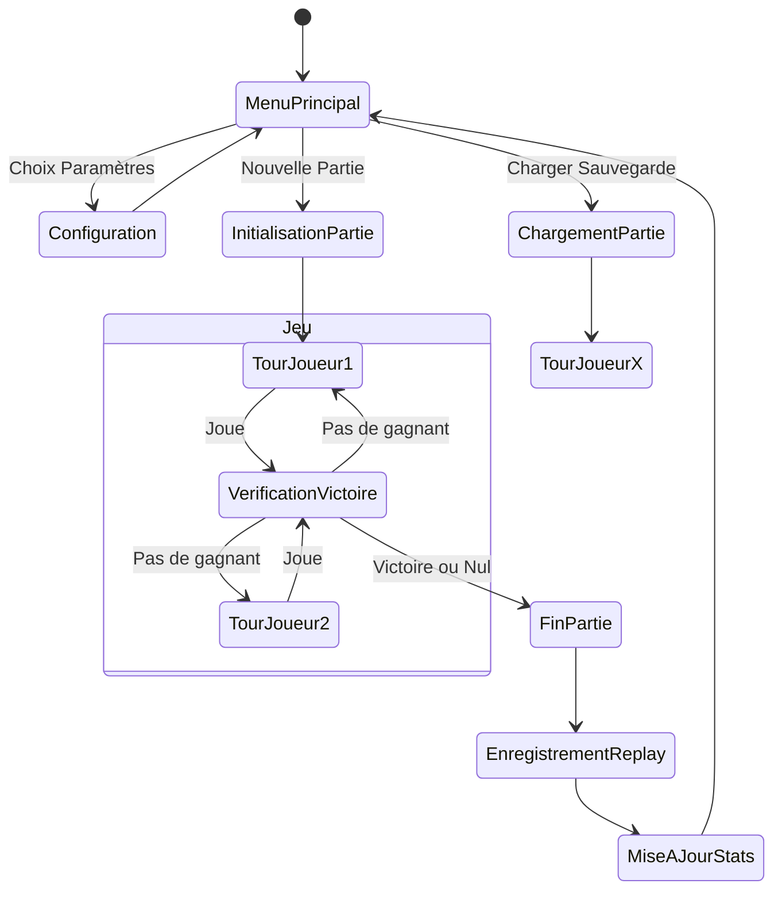
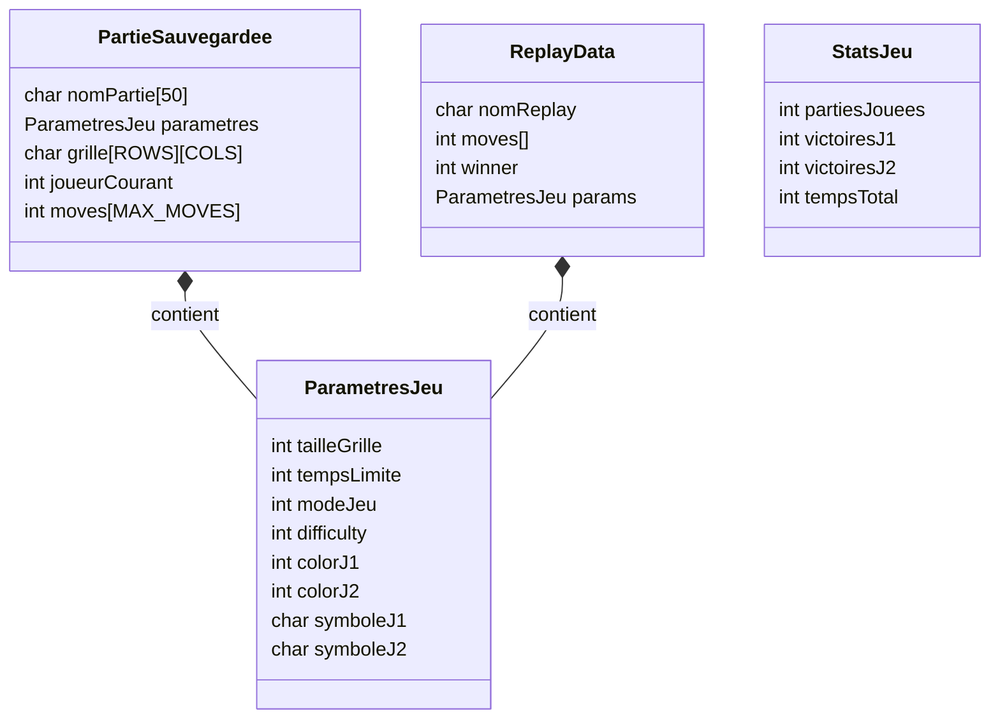

# RAPPORT DE PROJET : DÉVELOPPEMENT D'UN JEU DE PUISSANCE 4 EN LANGAGE C

---

**Auteur :** [Votre Nom / L'Équipe de Développement]
**Date :** Octobre 2023
**Contexte :** Projet Académique / Développement Logiciel

---

## REMERCIEMENTS

Nous tenons tout d'abord à remercier nos professeurs et encadrants pédagogiques pour leur soutien et leurs conseils avisés tout au long de ce projet. Leur expertise nous a permis de mieux appréhender les subtilités du langage C et les enjeux de la conception logicielle structurée.

Nous remercions également l'ensemble des contributeurs open-source et la communauté de développement dont les ressources documentaires ont été précieuses pour surmonter certains obstacles techniques, notamment concernant la gestion avancée des terminaux et l'algorithmique d'intelligence artificielle.

Enfin, une pensée pour nos camarades de promotion avec qui les échanges fructueux ont permis d'affiner nos idées et de tester nos implémentations dans une ambiance d'entraide stimulante.

---

## TABLE DES MATIÈRES

1.  [Introduction](#introduction)
2.  [Chapitre 1 : Analyse et Conception](#chapitre-1--analyse-et-conception)
    *   1.1 Présentation du Sujet
    *   1.2 Analyse des Besoins
    *   1.3 Modélisation Fonctionnelle (UML)
3.  [Chapitre 2 : Architecture Technique](#chapitre-2--architecture-technique)
    *   2.1 Choix Technologiques
    *   2.2 Structure Modulaire du Projet
    *   2.3 Structures de Données
4.  [Chapitre 3 : Algorithmique et Intelligence Artificielle](#chapitre-3--algorithmique-et-intelligence-artificielle)
    *   3.1 Gestion de la Grille et Mécaniques de Jeu
    *   3.2 L'Intelligence Artificielle : Minimax et Alpha-Beta
5.  [Chapitre 4 : Interface Utilisateur et Expérience (UX)](#chapitre-4--interface-utilisateur-et-expérience-ux)
    *   4.1 Conception de l'Interface en Mode Texte (TUI)
    *   4.2 Gestion des Entrées Utilisateur
6.  [Chapitre 5 : Persistance des Données](#chapitre-5--persistance-des-données)
7.  [Chapitre 6 : Difficultés Rencontrées et Solutions](#chapitre-6--difficultés-rencontrées-et-solutions)
8.  [Conclusion et Perspectives](#conclusion-et-perspectives)

---

## INTRODUCTION

Le développement de jeux vidéo est un exercice classique mais formateur en informatique, permettant de synthétiser des compétences variées allant de l'algorithmique fondamentale à la gestion de la mémoire, en passant par la conception d'interfaces. Ce rapport détaille le processus de création d'un jeu de Puissance 4 (Connect 4) complet, réalisé en langage C.

L'objectif n'était pas seulement de reproduire les règles de base, mais de fournir une application robuste, dotée de fonctionnalités avancées telles que la sauvegarde de partie, un mode replay, des statistiques persistantes et une intelligence artificielle capable de rivaliser avec un joueur humain.

Ce document retrace l'intégralité du cycle de vie du projet, depuis la phase de conception théorique jusqu'à l'implémentation finale, en mettant l'accent sur les choix architecturaux et les défis techniques relevés.

---

## CHAPITRE 1 : ANALYSE ET CONCEPTION

### 1.1 Présentation du Sujet

Le Puissance 4 est un jeu de stratégie combinatoire abstrait se jouant à deux. Le but est d'aligner quatre pions de sa couleur horizontalement, verticalement ou diagonalement sur une grille, traditionnellement de 6 lignes et 7 colonnes. Notre implémentation devait permettre une flexibilité sur ces paramètres (taille de grille variable) et offrir une expérience utilisateur fluide dans un terminal.

### 1.2 Analyse des Besoins

Avant d'écrire la moindre ligne de code, nous avons identifié les besoins fonctionnels et non-fonctionnels du système.

**Besoins Fonctionnels :**
*   **Modes de jeu :** Joueur contre Joueur (PvP) et Joueur contre Ordinateur (PvC).
*   **Paramétrage :** Possibilité de changer la taille de la grille, les symboles des joueurs, les couleurs, et la difficulté de l'IA.
*   **Sauvegarde :** Capacité à interrompre une partie et la reprendre ultérieurement (persistance).
*   **Historique :** Enregistrement des parties pour les revoir (Replay).
*   **Statistiques :** Suivi des victoires, défaites et temps de jeu global.

**Besoins Non-Fonctionnels :**
*   **Performance :** L'IA doit répondre dans un délai raisonnable (moins de 2-3 secondes).
*   **Portabilité :** Le code doit être standard (C99/C11) et fonctionner dans un environnement Unix/Linux.
*   **Ergonomie :** L'interface textuelle doit être claire, centrée, et utilisable au clavier (flèches directionnelles).

### 1.3 Modélisation Fonctionnelle

Pour visualiser les interactions, nous avons établi un diagramme de cas d'utilisation.

```mermaid
usecaseDiagram
    actor Joueur as "Joueur Humain"
    actor Systeme as "Système de Fichiers"

    package "Menu Principal" {
        usecase "Configurer le Jeu" as UC_Config
        usecase "Lancer une Partie" as UC_Play
        usecase "Consulter Stats" as UC_Stats
        usecase "Voir Replay" as UC_Replay
    }

    package "Jeu" {
        usecase "Placer un Pion" as UC_Move
        usecase "Sauvegarder Partie" as UC_Save
        usecase "Gagner/Perdre" as UC_Win
    }

    Joueur --> UC_Config
    Joueur --> UC_Play
    Joueur --> UC_Stats
    Joueur --> UC_Replay

    UC_Play ..> UC_Move : include
    UC_Move ..> UC_Win : include
    UC_Move ..> UC_Save : extend

    UC_Save --> Systeme : Écriture Binaire
    UC_Replay --> Systeme : Lecture Historique
```

Nous avons également modélisé le flux principal d'une partie pour comprendre l'enchaînement des états.



---

## CHAPITRE 2 : ARCHITECTURE TECHNIQUE

### 2.1 Choix Technologiques

*   **Langage C :** Choisi pour sa performance brute et sa gestion fine de la mémoire, essentielle pour implémenter des algorithmes récursifs comme le Minimax sans surcharge (overhead) excessive.
*   **Makefile :** Utilisé pour l'automatisation de la compilation. La compilation séparée a été privilégiée pour éviter de recompiler tout le projet à chaque modification mineure.
*   **Bibliothèques Standard :** Nous nous sommes limités à la bibliothèque standard (`stdio.h`, `stdlib.h`, `string.h`, `time.h`) et aux appels système POSIX (`unistd.h`, `termios.h`) pour la gestion du terminal, évitant ainsi des dépendances lourdes comme `ncurses` pour garder le contrôle total sur le flux de sortie.

### 2.2 Structure Modulaire du Projet

Pour garantir la maintenabilité, nous avons adopté une architecture modulaire stricte. Le code est divisé en composants logiques, séparant l'interface, la logique métier et la gestion des données.

*   **Core (Noyau) :** `main.c`, `commun.h`. Point d'entrée et constantes globales.
*   **Logique de Jeu :** `game.c`, `grid.c`. Gestion des règles, de la grille et des tours.
*   **Intelligence Artificielle :** `ai.c`. Contient toute la logique décisionnelle de l'ordinateur.
*   **Interface (UI/UX) :** `ui.c`, `menu.c`, `input.c`. Gestion de l'affichage ANSI, du centrage dynamique et des entrées clavier brutes.
*   **Persistance :** `save.c`, `replay.c`, `config.c`, `autosave.c`. Gestion des fichiers binaires.
*   **Données :** `stats.c`. Gestion des statistiques globales.

### 2.3 Structures de Données

Les structures de données ont été conçues pour être compactes et facilement sérialisables.



L'utilisation de tableaux statiques (ex: `char grille[MAX_ROWS][MAX_COLS]`) dans les structures de sauvegarde a été préférée aux pointeurs pour permettre une écriture directe (`fwrite`) de la structure entière dans un fichier binaire, simplifiant grandement la sérialisation.

---

## CHAPITRE 3 : ALGORITHMIQUE ET INTELLIGENCE ARTIFICIELLE

### 3.1 Gestion de la Grille et Mécaniques de Jeu

La grille est représentée logiquement par une matrice de caractères. Bien que l'affichage inverse les lignes (ligne 0 en haut), la logique d'insertion simule la gravité : un pion inséré dans une colonne "tombe" jusqu'à la première case vide en partant du bas (indice de ligne le plus élevé).

La vérification de victoire est un algorithme critique qui doit être exécuté après chaque coup. Nous avons implémenté une vérification optimisée qui scanne la grille selon quatre axes :
1.  Horizontal
2.  Vertical
3.  Diagonale descendante (\\)
4.  Diagonale montante (/)

### 3.2 L'Intelligence Artificielle : Minimax et Alpha-Beta

Le cœur de notre mode PvC réside dans l'algorithme **Minimax**, optimisé par l'élagage **Alpha-Beta**.

#### Principe du Minimax
L'algorithme construit un arbre de tous les coups possibles jusqu'à une certaine profondeur. Il alterne entre deux types de nœuds :
*   **Max (L'IA) :** Cherche à maximiser son score.
*   **Min (L'Adversaire) :** Cherche à minimiser le score de l'IA (c'est-à-dire maximiser le sien).

#### Élagage Alpha-Beta
Pour améliorer les performances et permettre une recherche plus profonde, nous avons ajouté l'élagage Alpha-Beta. Cette technique permet de ne pas explorer des branches de l'arbre dont on sait déjà qu'elles sont moins bonnes qu'une solution précédemment trouvée. Cela réduit drastiquement le nombre de nœuds visités.

#### Niveaux de Difficulté
*   **Facile (1) :** Coup purement aléatoire.
*   **Moyen (2) :** Une heuristique simple : si l'IA peut gagner immédiatement, elle le fait. Sinon, si l'adversaire peut gagner au coup suivant, elle bloque. Sinon, elle joue aléatoirement.
*   **Difficile (3) :** Utilisation complète du Minimax avec une profondeur de 5 coups, permettant d'anticiper les pièges et de construire des attaques complexes.

---

## CHAPITRE 4 : INTERFACE UTILISATEUR ET EXPÉRIENCE (UX)

L'un des défis majeurs était de rendre une application console "agréable" et moderne.

### 4.1 Conception de l'Interface en Mode Texte (TUI)

Nous avons utilisé intensivement les **séquences d'échappement ANSI** pour :
*   **Couleurs :** Différencier les joueurs (Rouge, Jaune, Cyan, etc.).
*   **Positionnement :** Centrer le texte horizontalement et verticalement. Une fonction dédiée calcule la taille du terminal via `ioctl` (appel système) pour ajuster les marges dynamiquement.
*   **Nettoyage :** Effacer l'écran ou revenir au début de la ligne pour des mises à jour fluides sans scintillement excessif.

### 4.2 Gestion des Entrées Utilisateur

Pour une navigation intuitive (flèches directionnelles), l'entrée standard (`stdin`) ne pouvait pas rester en mode "canonique" (où l'entrée n'est validée qu'après Entrée).

Nous avons configuré le terminal en mode **Raw** via la structure `termios`. Cela permet :
*   De lire chaque touche instantanément.
*   De détecter les séquences multi-octets envoyées par les touches fléchées (ex: `Esc [ A`).
*   D'implémenter un curseur visuel au-dessus de la grille qui se déplace latéralement.

Le système utilise également `select()` pour gérer les timeouts (temps limite par tour) sans bloquer le programme indéfiniment sur une attente de touche.

---

## CHAPITRE 5 : PERSISTANCE DES DONNÉES

La persistance a été traitée avec sérieux pour assurer la continuité de l'expérience.

### Sauvegardes de Partie
Les parties sont stockées dans un fichier binaire `sauvegardes.dat`. Chaque sauvegarde capture l'état exact de la grille, le joueur courant, l'historique des coups (pour le replay éventuel) et les paramètres de la partie. L'utilisation de fichiers binaires rend les sauvegardes très compactes et rapides à charger, contrairement à des formats texte comme JSON ou XML qui nécessiteraient un parsing coûteux.

### Système de Replay
À chaque fin de partie, l'intégralité de la liste des coups joués est sauvegardée dans `replays.dat`. La fonctionnalité de visionnage ne stocke pas une vidéo, mais *rejoue* littéralement la partie coup par coup en réutilisant le moteur de jeu. Cela garantit une fidélité parfaite avec un coût de stockage minimal (quelques kilo-octets pour des centaines de parties).

---

## CHAPITRE 6 : DIFFICULTÉS RENCONTRÉES ET SOLUTIONS

### 1. Gestion du Buffer d'Entrée
**Problème :** Lors du mélange d'appels `scanf` (pour les nombres) et `fgets` (pour les chaînes) ou `read` (mode raw), des caractères résiduels (comme `\n`) restaient souvent dans le buffer, causant des sauts de menus intempestifs.
**Solution :** Implémentation de fonctions de nettoyage robustes (`viderBuffer`) et transition vers une gestion quasi-exclusive des entrées via notre wrapper `readKey` et `menuSelection` pour uniformiser le comportement.

### 2. Segmentation Faults avec l'IA
**Problème :** L'algorithme Minimax récursif provoquait parfois des dépassements de pile ou des accès mémoire invalides lors des simulations de coups sur les bords de la grille.
**Solution :** Vérification rigoureuse des bornes de la grille avant toute simulation et utilisation de copies temporaires de la grille (ou d'annulations de coups : backtracking) pour ne pas corrompre l'état réel du jeu.

### 3. Portabilité des Séquences ANSI
**Problème :** L'affichage variait selon les émulateurs de terminal.
**Solution :** Standardisation sur les codes ANSI les plus communs et calcul dynamique des dimensions du terminal à chaque rafraîchissement pour s'adapter au redimensionnement de la fenêtre.

---

## CONCLUSION ET PERSPECTIVES

Ce projet de Puissance 4 a été une opportunité exceptionnelle de mettre en pratique les concepts théoriques du développement logiciel en C. Nous avons réussi à livrer un produit fini qui dépasse les attentes initiales, offrant une interface soignée, une IA compétente et des fonctionnalités de persistance robustes.

Au-delà de l'aspect ludique, ce travail a renforcé notre compréhension de l'architecture logicielle : comment séparer les responsabilités, gérer la mémoire manuellement et interagir avec le système d'exploitation à bas niveau.

**Perspectives d'amélioration :**
*   **IA par Réseaux de Neurones :** Remplacer ou compléter le Minimax par une approche de Machine Learning pour une difficulté encore plus organique.
*   **Mode Réseau :** Implémenter des sockets TCP/IP pour permettre à deux joueurs de s'affronter sur des machines distantes.
*   **Interface Graphique :** Porter le jeu sur une bibliothèque comme SDL ou Raylib pour une expérience visuelle plus riche, bien que le charme du TUI soit conservé.

Ce projet restera une pierre angulaire de notre parcours académique, témoignant de notre capacité à mener à bien un développement complexe et structuré.

---

**BIBLIOGRAPHIE**

1.  *The C Programming Language*, Brian Kernighan & Dennis Ritchie.
2.  Documentation POSIX (termios, unistd).
3.  *Artificial Intelligence: A Modern Approach*, Stuart Russell & Peter Norvig (pour les concepts Minimax).
4.  Ressources communautaires sur l'implémentation des jeux de plateau (StrategyWiki, GitHub).

---
*Fin du Rapport*
